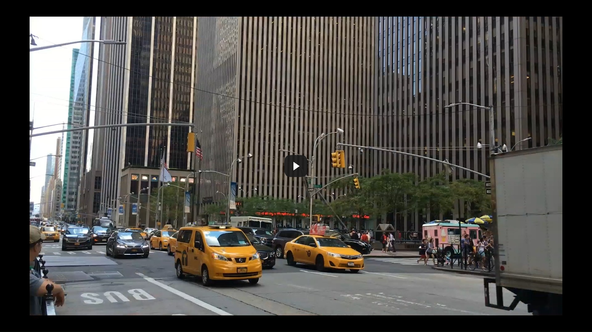
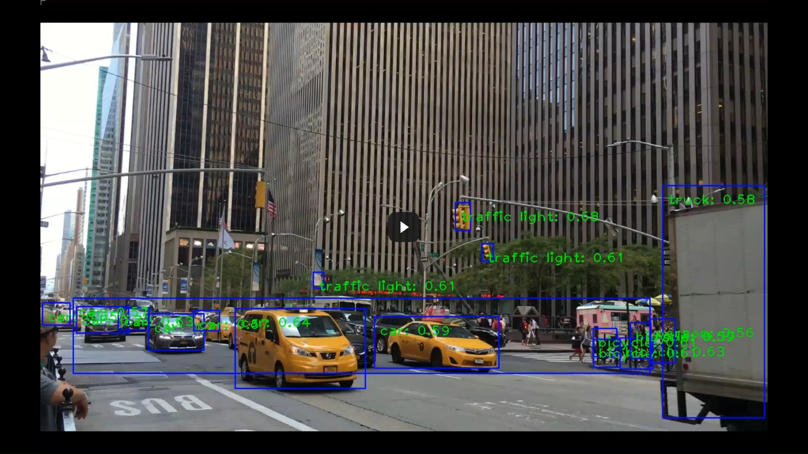

# Object-Detection and Classification
Real-time and Non-real-time Object Detection and Classification

This repository uses a pre-trained deep learning-based object detection and classification model "[MobileNet-SSD v3](https://github.com/opencv/opencv/wiki/TensorFlow-Object-Detection-API)" to detect, classify, and label objects belonging to 80 different classes by making use of the [MS COCO](https://cocodataset.org/#home) (Microsoft Common Objects in Context) dataset.

## Technical details
The coding was done fully in python using [Python v3.12.7](https://www.python.org/downloads/release/python-3127/) in [Jupyter Notebook v7.2.2](https://jupyter-notebook.readthedocs.io/en/stable/) through [Anaconda Navigator v2.6.4](https://www.anaconda.com/) platform. Labels were constructed and fixed/edited in labels.txt file using [mscoco_label_map.pbtxt](https://github.com/tensorflow/models/blob/45ecd69155b8279d550e1d51f1cc01e5f0eeaebb/research/object_detection/data/mscoco_label_map.pbtxt) as a reference.

1. **Libraries used**
   - [OpenCV v4.10.0](https://opencv.org/releases/)
   - [matplotlib v3.9.3](https://matplotlib.org/stable/users/release_notes#version-3-9)

2. **Description of files used**
   - ssd_mobilenet_v3_large_coco_2020_01_14.pbtxt
     - This is the configuration file for the MobileNet-SSD v3 model, defining its architecture and settings. 
   - frozen_inference_graph.pb
     - This is the pre-trained frozen model for the MobileNet-SSD v3 model, defining the weights, which represent learned parameters of the model.
   - labels.txt
     - This is the text file where all the labels belonging to 80 different classes reside.
   - source.ipynb
     - This file contains the source code for the execution of this whole project.

## Project Showcase

1. **Non-real-time Object Detection in a sample image**
   - Sample input image

     - To test with your own image, modify the code in line as shown below:\
       `bk` to `kb`

   

   - Sample output image

   

2. **Non-real-time Object Detection in a sample video**
   - Sample input video
  
     - To test with your own video, modify the code in line as shown below:\
       `bk` to `kb`

     \
     
      
      
       
   - Sample output video
     \
     \
     \
     
 

3. **Real-time Object Detection**

   - For Real-time Object Detection through your webcam, or any other imaging device, modify the code in line of as shown below:\
     `bk` to `kb`
       

     
